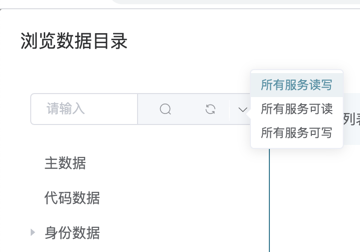

# IGA

## 产品说明
身份治理

###  构建命令
vm构建命令，根据实际环境替换对应的值<br/>
```
待补充
```  
   
# 初始化数据库脚本
* 初次部署直接执行以下sql即可安装最新完整数据库
iga/sql/iga.sql
# 更新数据库脚本
* 在部署过环境进行更新，根据日期逐条执行sql
iga/sql/update/update.sql

# 如何安装

1：运行数据脚本 <br/>
2：安装接口: http://ip:端口/iga/api/event <br/>
入参参考：<br/>
{
"clientId": "", // 应用client_id <br/>
"authCode": "", // 授权code,用于调用网关接口获取租户及应用启用信息 用client secret的值<br/>
"timestamp": ,  //时间戳 <br/>
"eventType": "create_tenant", //消息事件类型，值：「create_tenant:租户启用|disable_tenant: 禁用租户|delete_tenant: 删除租户 <br/>
tenantId: "" 租户全局code(domain)
}<br/>

安装成功返回：{"success": true}<br/>

curl 参考：
curl --location --request POST 'http://ip:端口/iga/api/event' \
--header 'Content-Type: application/json' \
--data-raw '{
    "eventType": "create_tenant",
    "tenantId": "租户",
    "authCode": "XXX",
    "clientId": "XXX",
    "timestamp": XXX
}'

3:将iga注册进maker，可获取到 clientId 和 clientSecret<br/>

4:通过maker数据集成【页面路径：/service/register】将iga的接口地址作为**数据服务**新增到网关中<br/>
注册数据服务参数：<br/>
**服务代码**：iga； <br/>
**描述**：iga； <br/>
**后端地址**：[https|http]://域名/iga/graphql<br/>
配置完成后可获得**服务地址**<br/>

5:授权<br/>
【前置条件：bus部署完成，console本身部署完成 】<br/>
通过console 应用中心  -->  应用中心授权 -->【搜索iga】 --> 右侧点击"编辑权限" --> 选择所有"服务读写"<br/>



# 环境变量说明【Environment】：<br/>

| 参数 | 参数说明 |  参考值 | 
| ------ | ------ | ------ | 
| IGA_DATASOURCE_URL | IGA项目本身数据库地址 | jdbc:mysql://XXXX:3306/iga?rewriteBatchedStatements=true
| IGA_DATASOURCE_USERNAME | 数据库用户名 | ----- 
| IGA_DATASOURCE_PASSWORD | 数据库地址 | ----- 
| SSO_DATASOURCE_URL | sso项目数据库地址 | jdbc:mysql://XXXX:3306/sso?rewriteBatchedStatements=true
| SSO_DATASOURCE_USERNAME | 数据库用户名 | ----- 
| SSO_DATASOURCE_PASSWORD | 数据库地址 | ----- 
| SSO_API_DATASOURCE_URL | sso-api项目数据库地址 | jdbc:mysql://XXXX:3306/sso-api?rewriteBatchedStatements=true
| SSO_API_DATASOURCE_USERNAME | 数据库用户名 | ----- 
| SSO_API_DATASOURCE_PASSWORD | 数据库地址 | ----- 
| OAUTH_AUTHORIZE_URL | OAuth Authority 地址 | https://cloud.ketanyun.cn/sso/oauth2/authorize 支持多租环境，多组环境下任意挑选其中一租户的sso绝对路径
| OAUTH_TOKEN_URL |  OAuth Token 地址 | https://cloud.ketanyun.cn/sso/oauth2/token 支持多租环境，多组环境下任意挑选其中一租户的sso绝对路径
| BUS_URL | BUS服务地址  | https://cloud.ketanyun.cn/bus/graphql/builtin 支持多租环境，多组环境下任意挑选其中一租户的bus绝对路径
| OAUTH_CLIENT | 应用id | ------
| OAUTH_CLIENT_SECRET | 应用密钥 |------
| TASK_CRON | 同步时间 | 控制定时同步任务间隔时间。默认值 0 */5 * * * ?
| FILE_URL | 【*】文件服务地址 | https://cloud.ketanyun.cn/file
| SERVICE_ORIGIN | 【*】云服务的通用域名，用于后台直接调用服务时做相对路径拼接  | 格式示例：https://example.com

* 注：
-- 在maker中创建应用，并在sso/admin中勾选scope客户端认证：data、introspect、storage<br/>
-- 数据库链接地址中 注意增加参数rewriteBatchedStatements=true  以提高性能
-- SERVICE_ORIGIN 为标准环境变量，若不能提供则必须保持SSO_URL、BUS_URL为绝对路径。
  


# 表达式支持

|         描述           | 表达式参考             |    推荐场景            |
| --------------------- | -------------------   | -------------------  
|  变量                  |   $Code               |  将数据中Code字段作为变量
|  常量                  |   ABC                 | 将ABC作为固定不变的值，一般作用于字段映射赋值
|  全部数据               |   =*                  |  挂载、排除规则        
|  正则过滤数据            |   =Reg("^hr_20.$")    |  挂载、排除规则        
|  重命名计算脚本           |   ="hr_"+$Code        |  字段映射 对值重新赋值  
|  判断计算脚本             |  =if($Code=='ABC'){ "1"+$Code } | 字段映射 对值重新赋值  

# 异常说明(具体报错原因查看对应提示)

| 错误代码              | 状态码 | 描述                                      |
| --------------------- | ------ | ----------------------------------------- |
| SUCCESS               | 1000   | 操作成功                                   |
| UNMOUNT               | 1001   | 节点规则无法找到挂载节点                     |
| NO_MOUNT              | 1002   | 节点规则没有挂载规则                        |
| NULL_MOUNT            | 1003   | 配置节点为空                              |
| ILLEGAL_MOUNT         | 1004   | 节点中的挂载规则 表达式非法,请检查            |
| ILLEGAL_EXCLUSION     | 1010   | 节点中的排除规则 表达式非法,请检查            |
| NO_EXCLUSION          | 1011   | 节点规则无法找到排除节点                     |
| NULL_EXCLUSION        | 1012   | 节点规则的排除规则为空                      |
| MONITOR_ERROR         | 1020   | 删除数量超出监控设定                       |
| NO_UPSTREAM_TYPE      | 1030   | 对应拉取节点无权威源类型数据               |
| CYCLE_ERROR           | 1040   | 节点中的数据与节点中的数据循环依赖         |
| REPEAT_ERROR          | 1041   | 节点中的数据节点中的数据重复              |
| ILLEGAL_DATA          | 1050   | 含非法数据(名称或CODE为空的数据),请检查    |
| PERSON_ERROR          | 1070   | 人员治理中类型:对应权威源类型拉取报错       |
| OCCUPY_ERROR          | 1071   | 人员身份治理中类型:对应权威源类型拉取报错    |
| EXPRESSION_ERROR      | 1080   | 表达式不符合规范请检查                    |
| GET_DATA_ERROR        | 1081   | 获取数据失败                             |
| ADD_UPSTREAM_ERROR    | 1082   | 添加权威源失败                           |
| UPDATE_UPSTREAM_ERROR | 1083   | 修改权威源失败                           |
| REPEAT_UPSTREAM_ERROR | 1084   | appCode 或 appName 不能重复,添加失败      |
| FAILED                | 1100   | 操作失败                                |

